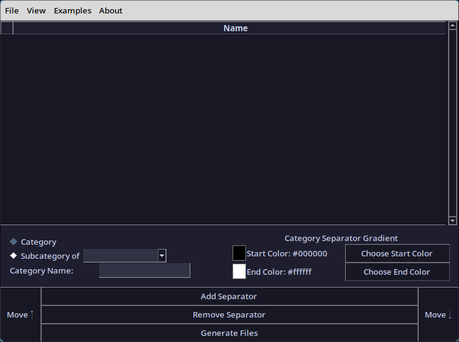

# Mod Organizer 2 Separator Generator (MO2SG)
<p align="center"></img></p>

A tool for creating separators for categorization within Mod Organizer 2, making it easier to manage large collections of mods.

> This is my first major work in Python, teaching myself the language by converting a Powershell script I made into a Python script (with an easy UI!). And feedback is welcome!

## Features
- Create and manage categories and subcategories for mod organization.
- Customize category headers and appearance.
- Apply themes and color accents to the interface.
- Generate output files for use in Mod Organizer 2.
- Load and save configurations in JSON format.
- Support for both Windows and Linux

## Installation
### Windows

>#### Easy
> 1. Download the latest [exe release](https://github.com/Furglitch/ModOrganizer-SeparatorGenerator/releases) 
> 2. Run it!
>
>#### Harder - Build It Yourself!
> 1. Clone the repository and enter it:
> ```powershell
> git clone https://github.com/Furglitch/ModOrganizer-SeparatorGenerator.git
> cd ModOrganizer-SeparatorGenerator
> ```
> 2. Install the requirements
> ```powershell
> pip install -r requirements.txt
> ```
> 3. Build the executable!
> ```powershell
> pyinstaller -n "MO2SG" --onefile -w interface.py backend.py --add-data "resources;resources" -i "resources/icon.ico"
> ```
> You will find the executible in the dist folder.

### Linux

> Unfortunately, I've yet to figure out how to create an executable file from linux
>
> 1. Clone the repository and enter it:
> ```bash
> git clone https://github.com/Furglitch/ModOrganizer-SeparatorGenerator.git
> cd ModOrganizer-SeparatorGenerator
> ```
> 2. Install the requirements
> ```bash
> pip install -r requirements.txt
> ```
> Note: Depending on your distro, you may have to install these through a package manager. (i.e. AUR: `yay -Sy python-pillow tk`)
> 
> 3. Run interface.py
> ```bash
> python interface.py
> ```
> Note: There is also an executable `run.sh` file that does this, if you prefer double-clicking.

## Settings
Any changes you make in the settings menu can be saved with the click of a button.</br>
**Windows:** `%APPDATA%/Furglitch/MO2SG`</br>
**Linux:** `$HOME/.config/furglitch/MO2SG`</br>
This file is automatically created at launch and updated in the following directory:</br>

## Logging
The application logs almost everything to files located in the following directory:</br>
**Windows:** `%APPDATA%/Furglitch/MO2SG/logs`</br>
**Linux:** `$HOME/.config/furglitch/MO2SG/logs`</br>
These logs can be used for troubleshooting and debugging. Please include when reporting an issue.</br>

## Contributing
Contributions, critiques, and bug reports are welcome! If you have any suggestions or improvements, please create a pull request or open an issue.

## License
This project is licensed under the [MIT License](https://opensource.org/licenses/MIT).